# Hi 👋 I am Robert Alverez Jordan
## A passionate blockchain enginner

I am currently working remotely.

❤️ **I'm passionate about:**

I am blockchain developer
 I have 6+ years of experience writing blockchain web apps that span consumer productivity software to mission-critical financial trading platforms. I have extensive knowledge of smart contract, front-end JavaScript and browser APIs as well as significant experience with popular frameworks and libraries like React and Redux. As a full stack developer, my main programming language is Javascript, Solidty, Rust, Python. I have good experience with ❤️Rust❤️, Solidity, Web3, ❤️React.js❤️, Ethers, Python, Openzepplin. Particularly Solidity and Rust is my ❤️ framework and also I have rich experenice on React Framework(MERN), Truffle. Including framwork that said above, I have done 10+ web site with MERN, Nuxt, Next, Web3, Ethers.

I have also strong technical understanding of various machine learning algorithms, including Neural networks and Deep learning.

### About Me
#### Main Skills

### Git Work

## Lastest Product
### Defi
#### Geist Finance on Fantom
---
<a href='https://geist.finance/markets' target='_blank'>
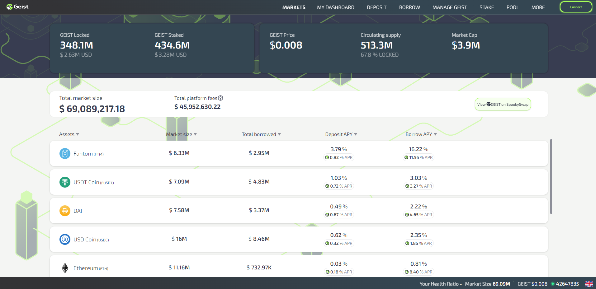</img>
</a>

[Geist Contract]()

#### Tree Defi Finance on BSC
---
##### Main Homepage
<a href='https://app.treedefi.com/' target='_blank'>
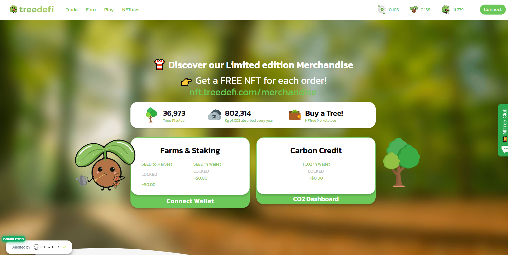</img>
</a>

##### Defi, NFT Staking, NFT Marketplace
<a href='https://dex.treedefi.com/' target='_blank'>
</img>
</a>
<a href='https://nft.treedefi.com/' target='_blank'>
</img>
</a>
<a href='https://nft.treedefi.com/merchandise' target='_blank'>
</img>
</a>

[Tree Defi Contract]()

### Vesq Finance on Polygon Main Net
---
<a href='https://vesq.io' target='_blank'>
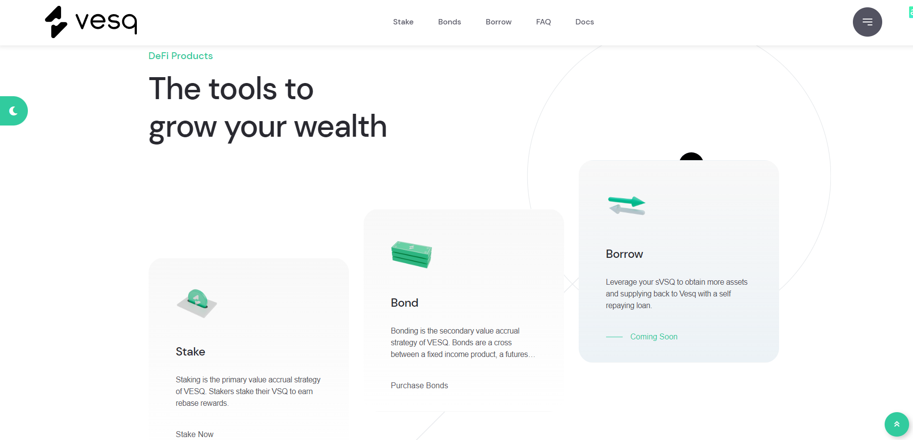</img>
</a>
<a href='https://app.vesq.io' target='_blank'>
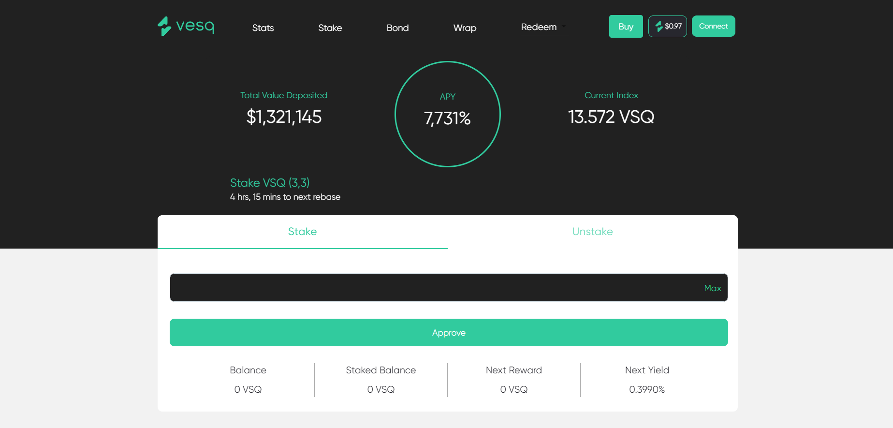</img>
</a>

[Vesq Finance Frontend - React-web3]()

### Blockchain Domain Name Service on Fantom
---
#### [FNS](https://fantomdomains.io/)
<a href='https://fantomnameservice.netlify.app/' target='_blank'>
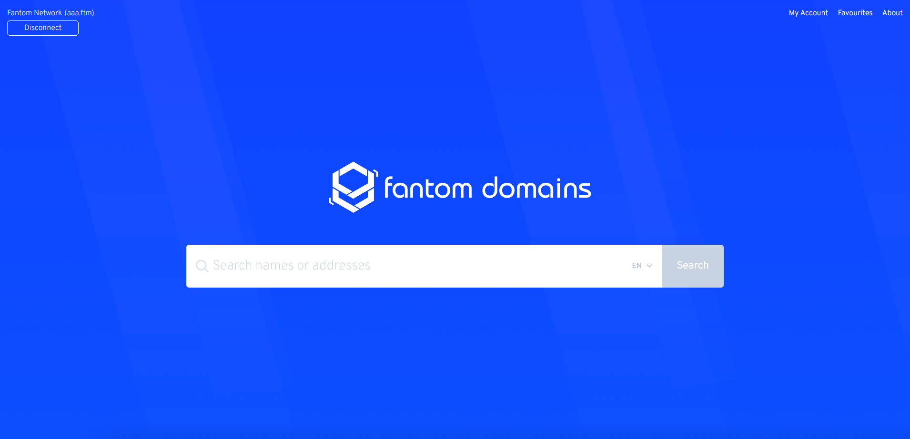</img>
</a>
<a href='https://fantomnameservice.netlify.app/search/aaa' target='_blank'>
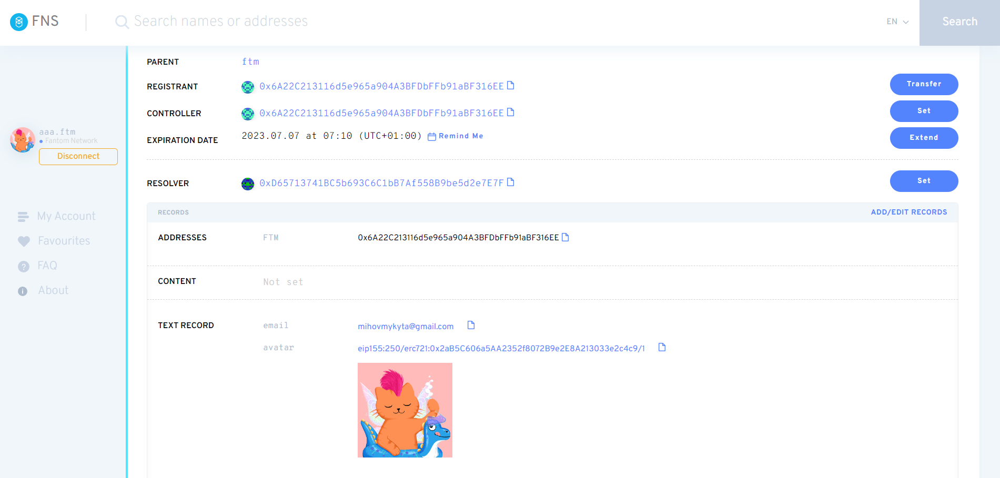</img>
</a>

- [FNS Contract](https://afd.o)
- [FNS Subgraph](https://afd.o)
- [FNS Metadata Service Backend](https://afd.o)
- [FNS Main Frontend](https://afd.o)

### Scorpfion Dragon NFT Marketplace on BSC
---
<a href='https://scorpfionnft.netlify.app/'>
</img>
</a>

- [Marketplace Contract]()
- [Marketplace Subgraph]()
- [Marketplace Backend]()
- [Marketplace indexer]()
- [Marketplace Main Frontend]()

### Staking
#### Bonsai NFT Staking
---
<a href='https://bonsaidefi.netlify.app/'>
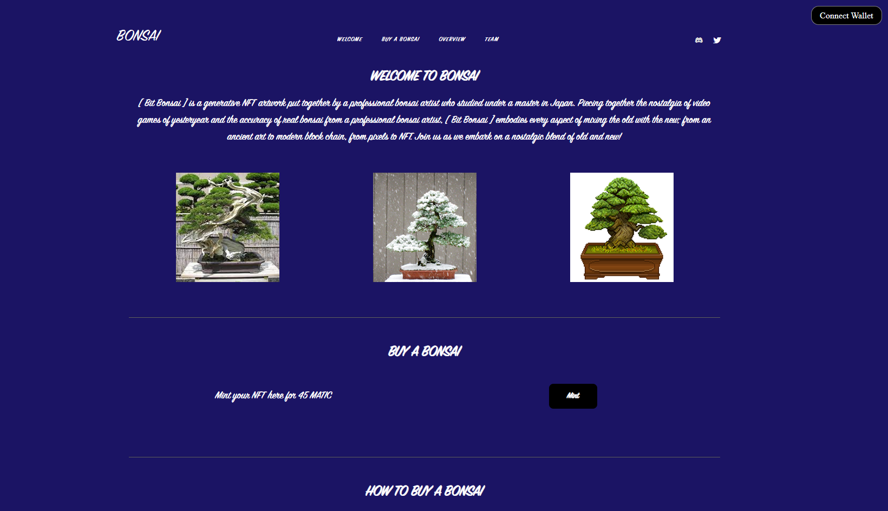</img>
</a>

- [Deployed Satking Contract]()

#### Satin Token Staking on BSC
---
<a href='https://satintoken.com/'>
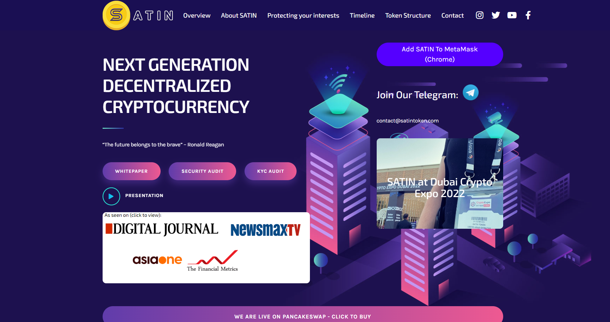</img>
</a>
<a href='https://satinsafe.space/'>
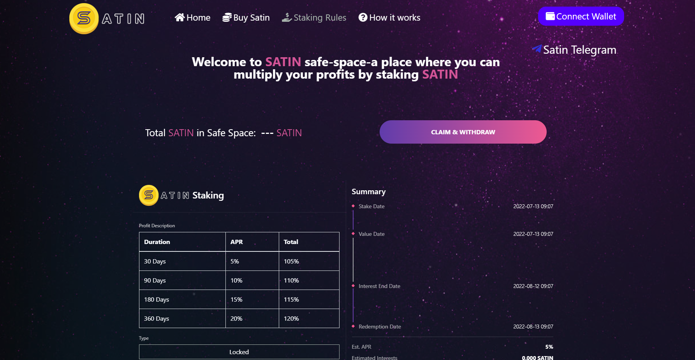</img>
</a>

- [Deployed Satking Contract]()

#### Avax Fomo Staking on Avax Chain
---
<a href='https://avaxfomo.netlify.app/'>
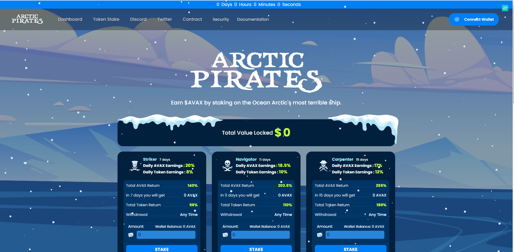</img>
</a>

- [Deployed Satking Contract]()

#### MMX Staking on Harmony Chain
---
<a href='https://stakemmx.herokuapp.com/'>
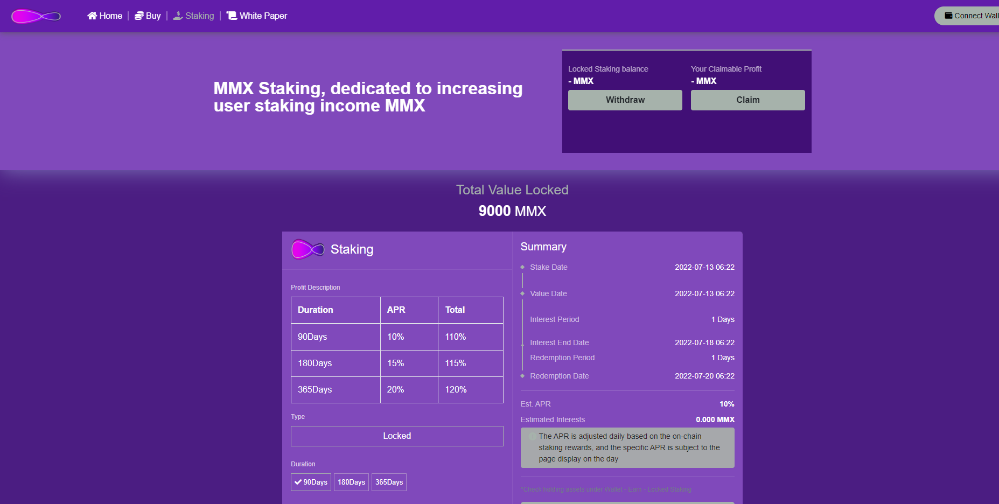</img>
</a>

- [Deployed Satking Contract]()

### Presale Site
#### Atari Token Presale
---
<a href='https://defi.atarichain.com/'>
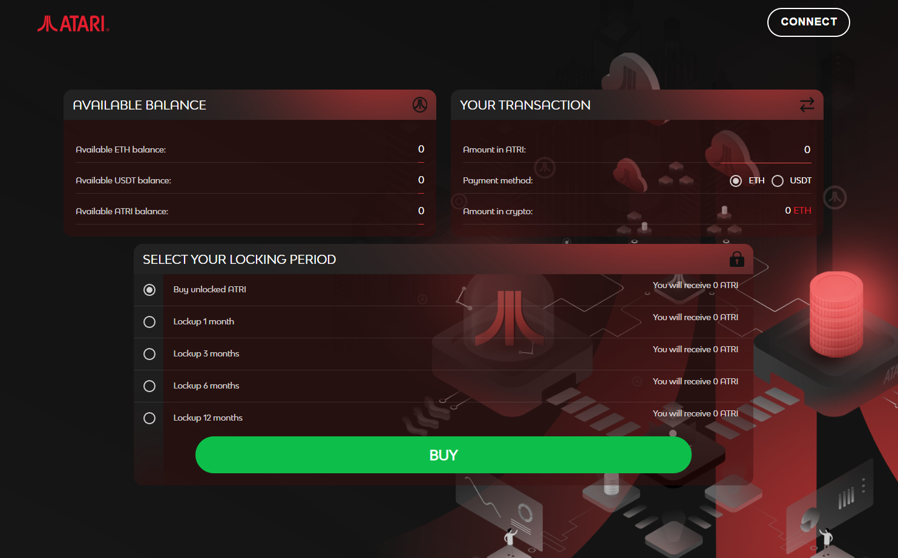</img>
</a>

### Blockchain Bot
---
- Flashloan Arbitrage Bot
- Coin AddLiquidity Frontrun Attack Bot
- Sandwich Bot
- Pancake Prediction Betting Bot
- PinkSale Trending Bot
- Sniper Bot
- NFT Rarity Sniper Bot on Opensea

### Contact Me
#### Social Link

#### Telecommunication

<!--
**goldenstar111/goldenstar111** is a ✨ _special_ ✨ repository because its `README.md` (this file) appears on your GitHub profile.

Here are some ideas to get you started:

- 🔭 I’m currently working on ...
- 🌱 I’m currently learning ...
- 👯 I’m looking to collaborate on ...
- 🤔 I’m looking for help with ...
- 💬 Ask me about ...
- 📫 How to reach me: ...
- 😄 Pronouns: ...
- ⚡ Fun fact: ...
-->
